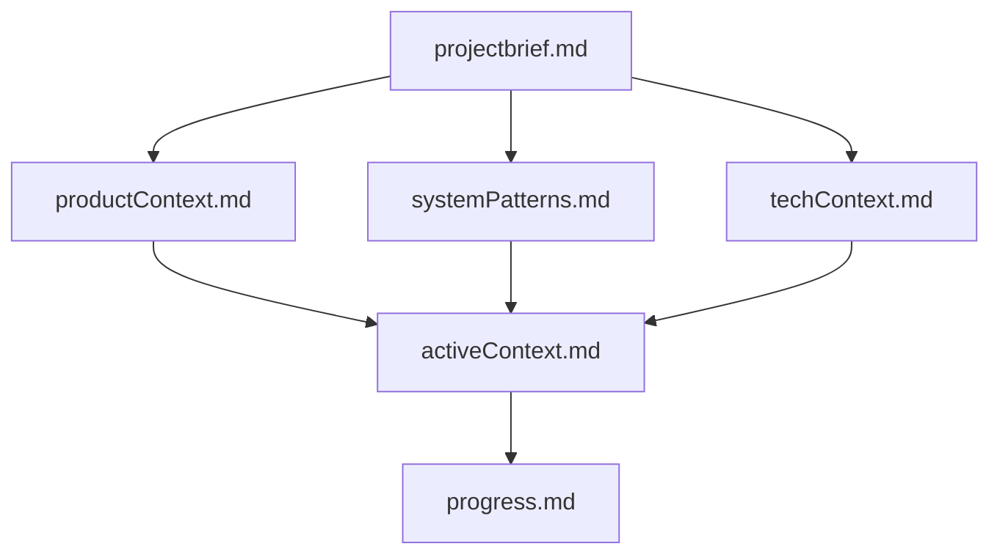

# CollabCanvas Memory Bank

## Purpose
This directory contains the persistent memory for AI assistants working on CollabCanvas. After each session reset, the AI reads these files to understand the project's current state, architecture, and context.

## Core Files

### 📋 projectbrief.md
**Foundation document** - Created first, shapes all other files
- Core requirements and constraints
- Success criteria
- Technical scope
- What's in/out of MVP

### 💡 productContext.md
**The "Why"** - Business and UX perspective
- Problems the project solves
- User experience goals
- Key user flows
- Design principles

### 🎯 activeContext.md
**Current state** - Most frequently updated
- Recent changes and bug fixes
- Active decisions and considerations
- Immediate next steps
- Context for next session

### 🏗️ systemPatterns.md
**Architecture deep dive**
- System architecture diagrams
- Key technical decisions
- Design patterns in use
- Code organization principles
- Common patterns and anti-patterns

### 🔧 techContext.md
**Technical details**
- Technology stack with versions
- Development setup instructions
- Project structure
- Dependencies and rationale
- Known technical debt

### 📊 progress.md
**Status tracking**
- ✅ What works (completed features)
- 🟡 What's in progress
- 🟢 What's planned
- Current metrics and performance
- Rubric progress

## File Relationships

## When to Update

### Every Session Start
1. Read ALL files (required)
2. Verify context is current
3. Note any discrepancies

### During Development
Update when:
- Implementing significant features
- Making architectural changes
- Fixing critical bugs
- Discovering new patterns
- User requests "update memory bank"

### Key Update Trigger
When user says **"update memory bank"**:
1. Review ALL files (even if unchanged)
2. Focus on `activeContext.md` and `progress.md`
3. Update `systemPatterns.md` if patterns changed
4. Ensure all recent work is documented

## Update Guidelines

### activeContext.md
Update most frequently:
- ✅ After completing major features
- ✅ After fixing critical bugs
- ✅ When active decisions change
- ✅ When focus shifts to new work

### progress.md
Update when:
- ✅ Features move from pending → completed
- ✅ New features added to backlog
- ✅ Known issues resolved
- ✅ Metrics change significantly

### systemPatterns.md
Update when:
- ✅ New architectural patterns emerge
- ✅ Design decisions change
- ✅ Code organization evolves
- ✅ Common patterns identified

### techContext.md
Update when:
- ✅ Dependencies added/changed
- ✅ Development setup changes
- ✅ New technical constraints
- ✅ Infrastructure updates

### productContext.md
Update when:
- ✅ User flows change
- ✅ Design principles evolve
- ✅ Problems solved shift

### projectbrief.md
Rarely changes (foundation):
- ✅ Only for scope changes
- ✅ Core requirements shift
- ✅ Success criteria redefined

## Current State Summary

**Last Updated**: January 16, 2025

**Project Status**: ✅ Production-ready with recent critical bug fix

**Recent Work**:
- Fixed disconnect cleanup bug (shapes being deleted left orphaned handlers)
- Implemented comprehensive E2E testing suite with Playwright
- E2E authentication approach pending user decision

**Immediate Next Steps**:
1. Deploy disconnect cleanup fix
2. Finalize E2E test authentication
3. Optional: Set up Firebase emulator

**Key Files to Know**:
- `src/services/canvas.js` - Just fixed disconnect cleanup
- `tests/e2e/*.spec.js` - E2E test suites ready
- `E2E_TESTING.md` - Testing documentation
- `.cursorrules` - Code organization principles

## For AI Assistants

### Session Start Checklist
- [ ] Read `projectbrief.md` - Understand foundation
- [ ] Read `productContext.md` - Understand "why"
- [ ] Read `activeContext.md` - Understand current state
- [ ] Read `systemPatterns.md` - Understand architecture
- [ ] Read `techContext.md` - Understand tech stack
- [ ] Read `progress.md` - Understand status

### Before Any Code Changes
- [ ] Check `activeContext.md` for current focus
- [ ] Check `systemPatterns.md` for patterns to follow
- [ ] Check `techContext.md` for constraints
- [ ] Check `.cursorrules` for code organization

### After Significant Work
- [ ] Update `activeContext.md` with changes
- [ ] Update `progress.md` with completed items
- [ ] Update `systemPatterns.md` if patterns changed
- [ ] Commit memory bank changes

## Additional Context

### Related Documentation
- `.cursorrules` - Code quality and DRY principles
- `E2E_TESTING.md` - End-to-end testing guide
- `FIREBASE_OPTIMIZATION.md` - Per-shape architecture details
- `PRD.md` - Original product requirements
- `PRD_UI_REDESIGN.md` - UI redesign specifications
- `REDESIGN_TASKS.md` - UI redesign task breakdown

### User Preferences
See `activeContext.md` → "Context for Next Session" → "User Preferences"

Key preferences:
- CSS variables over Tailwind (reliability)
- Systematic approach with TODO tracking
- Parallel tool calls for efficiency
- Always use `read_lints` after changes
- Thorough explanations of root causes

## Memory Bank Philosophy

> **"After every memory reset, I begin completely fresh. The Memory Bank is my only link to previous work. It must be maintained with precision and clarity, as my effectiveness depends entirely on its accuracy."**

This philosophy drives:
- **Completeness** - All critical information documented
- **Clarity** - Technical details without jargon overload
- **Currency** - Regular updates to match reality
- **Context** - Not just "what" but "why" and "how"
- **Continuity** - Seamless handoffs between sessions

